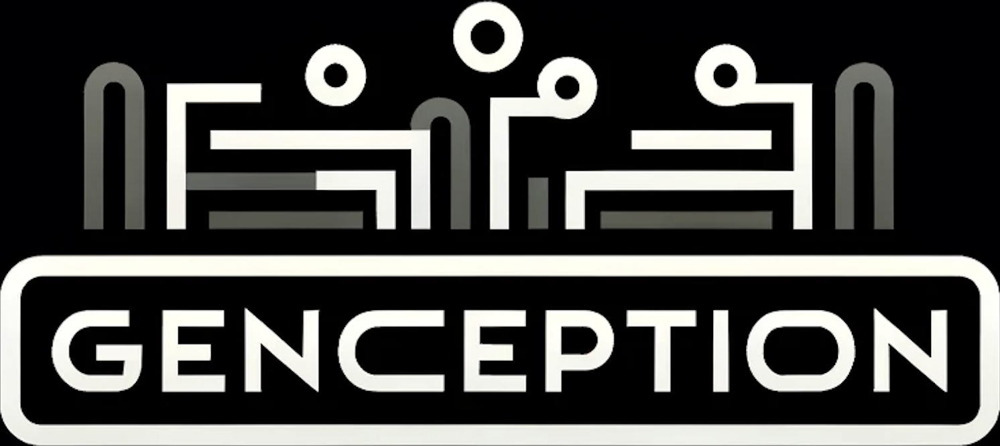

<div align="center">



**Evaluate Multimodal LLMs with Unlabeled Unimodal Data**

</div>

------

<p align="center">
  <a href="https://huggingface.co/spaces/valbuc/GenCeption">🔥🏅️🤗 Leaderboard🏅️🔥</a>&emsp;•&emsp;
  <a href="#contribute">Contribute</a>&emsp;•&emsp;
  <a href="https://arxiv.org/abs/2402.14973">Paper</a>&emsp;•&emsp;
  <a href="#cite-this-work">Citation</a> 
</p>

> GenCeption is an annotation-free MLLM (Multimodal Large Language Model) evaluation framework that merely requires unimodal data to assess inter-modality semantic coherence and inversely reflects the models' inclination to hallucinate.


GenCeption is inspired by a popular multi-player game [DrawCeption](https://wikipedia.org/wiki/drawception). Using the image modality as an example, the process begins with a seed image $\mathbf{X}^{(0)}$ from a unimodal image dataset for the first iteration ($t$=1). The MLLM creates a detailed description of the image, which is then used by an image generator to produce $\mathbf{X}^{(t)}$. After $T$ iterations, we calculate the GC@T score to measure the MLLM's performance on $\mathbf{X}^{(0)}$. 

The GenCeption ranking on [MME](https://github.com/BradyFU/Awesome-Multimodal-Large-Language-Models/tree/Evaluation) benchmarking dataset (without using any label) shows a strong correlation with other sophisticated benchmarks such as [OpenCompass](https://rank.opencompass.org.cn/leaderboard-multimodal) and [HallusionBench](https://github.com/tianyi-lab/HallusionBench). Moreover, the negative correlation with MME scores suggests that GenCeption measures distinct aspects not covered by MME, using the same set of samples. For detailed experimental analysis, please read [our paper](https://arxiv.org/abs/2402.14973).

We demostrate a 5-iteration GenCeption procedure below run on a seed images to evaluate 4 VLLMs. Each iteration $t$ shows the generated image $\mathbf{X}^{(t)}$, the description $\mathbf{Q}^{(t)}$ of the preceding image $\mathbf{X}^{(t-1)}$, and the similarity score $s^{(t)}$ relative to $\mathbf{X}^{(0)}$. The GC@5 metric for each VLLM is also presented. Hallucinated elements within descriptions $\mathbf{Q}^{(1)}$ and $\mathbf{Q}^{(2)}$ as compared to the seed image are indicated with  <span style="color:red"><u>red underlined</u></span>.


## Contribute

The GenCeption evaluation utilizes MME images, you can request it as [described here](https://github.com/BradyFU/Awesome-Multimodal-Large-Language-Models/blob/Evaluation/README.md#our-mllm-works).
We recommend to start by creating your virtual environment and installing dependencies:

```{bash}
conda create --name genception python=3.10 -y
conda activate genception
pip install -r requirements.txt
```

Firsly, you need to make sure setup the MLLM properly. For example, follow [this](https://github.com/X-PLUG/mPLUG-Owl/tree/main/mPLUG-Owl2#usage) to set up mPLUG-OWL2, follow [this](https://platform.openai.com/docs/guides/vision) to config ChatGPT-4v, follow [this](https://docs.anthropic.com/claude/docs/intro-to-claude) to config Claude-3, and so on. 

Secondly, you need to create your evaluation code by referring to how it is done for [ChatGPT-4V](genception/exp_gpt4v.py), [LLaVa](genception/exp_llava.py), [mPLUG](genception/exp_mplug.py) and [Claude](genception/exp_claude.py). Of course, you need to run through your code, for example, GenCeption on ChatGPT-4V (assuming a proper configuration of OPENAI_API_KEY) is run by

```{bash}
python -m genception.exp_claude --dataset=datasets/examples
```

Finally, run the following to calculate GC@T (T=3) metric:
```{bash}
python -m genception.evaluation --results_path=datasets/examples/results_gpt4v --t=3
```
This will generate a `GC@3.json` file under the same path.


### Contribute to leaderboard
After evaluating a model, please [**create a PR (Pull-Request)**](https://huggingface.co/spaces/valbuc/GenCeption/discussions?new_pr=true) in the 🤗 Space and add your model details and results to `leaderboard/leaderboard.json`. This will add your results to the [🔥🏅️**Leaderboard**🏅️🔥](https://huggingface.co/spaces/valbuc/GenCeption). 

### Contribute to code base
To add your evaluation code, please submit a PR in this GitHub repository. 

## Cite This Work
```bibtex
@article{cao2023genception,
    author = {Lele Cao and
              Valentin Buchner and
              Zineb Senane and
              Fangkai Yang},
    title = {{GenCeption}: Evaluate Multimodal LLMs with Unlabeled Unimodal Data},
    year={2023},
    journal={arXiv preprint arXiv:2402.14973},
    primaryClass={cs.AI,cs.CL,cs.LG}
}
```
